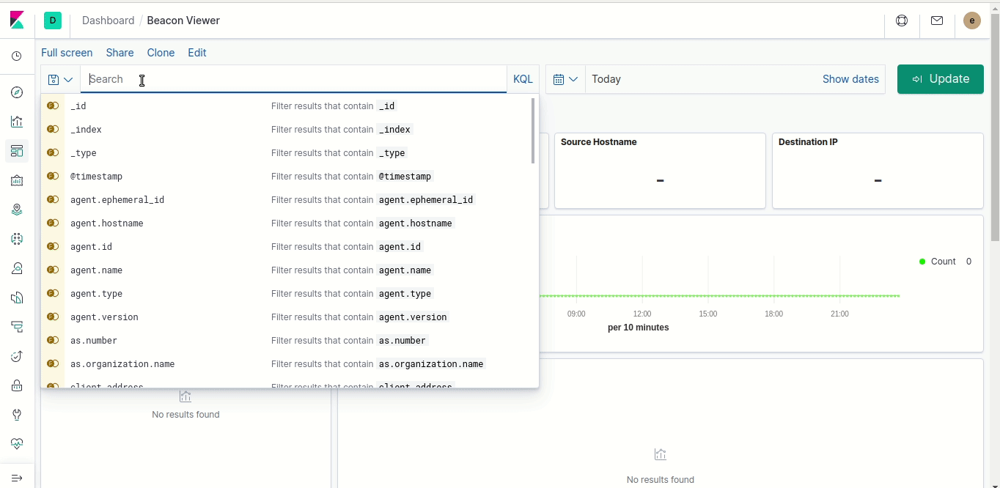

# BeaKer - Beaconing Kibana Executable Report

Brought to you by [Active Countermeasures](https://www.activecountermeasures.com/).

---

BeaKer visualizes Microsoft Sysmon network data to help threat hunters track down the source of suspicious network connections. The custom dashboard presents which users and executables created connections between two given IPs, how many times they've connected, the protocols and ports used, and much more.

## Getting Started

After Sysmon starts sending data to ElasticSearch, Kibana will be ready to go. Filter by a source and destination IP and a time range to view what connections have been made between the two. The Program List will display which executables on the source machine made the connections to the destination. The actual Sysmon logs are displayed lower on the screen where you can investigate the events in greater detail.

## How it works

- Microsoft Sysmon: Logs network connections to the Windows Event Log
- WinLogBeats: Sends the network connection logs to Elasticsearch
- Elasticsearch: Stores, indexes, and aggregates the network connection logs
- Kibana: Displays logs stored in Elasticsearch and provides a user interface for Elasticsearch administration
- Beacon Dashboard: Aggregates the network connections between two hosts

## Installation

### BeaKer Server System Requirements
* Operating System: The preferred platform is x86 64-bit Ubuntu 16.04 LTS. The system should be patched and up to date using apt-get.
  * The automated installer will also support CentOS 7.
* Processor: Two or more cores. Elasticsearch uses parallel processing and benefits from more CPU cores.
* Memory: 8-64GB. Monitoring more hosts requires more RAM.
* Storage: Ensure `/var/lib/docker/volumes` has free space for the incoming network logs.

### BeaKer Agent System Requirements
* Operating System: Windows x86-64 bit OS

### Automated Install: BeaKer Server

Download the latest release tar file, extract it, and inside the `BeaKer` directory,
run `./install_beaker.sh` on the Linux machine that will aggregate your Sysmon data and host Kibana.

The automated installer will:
  - Install Docker and Docker-Compose
  - Create a configuration directory in `/etc/BeaKer`
  - Install Elasticsearch, Kibana, and load the dashboards
  - Set the Elasticsearch superuser password for the `elastic` account
  - Set the `sysmon-ingest` user password for connecting WinLogBeats

The `./beaker` script inside of the release tar file is a wrapper around `docker-compose` and can be used to manage BeaKer.
 - To stop BeaKer, run `./beaker down`
 - To start Beaker, run `./beaker up`
 - To view the logs of the Elasticsearch container, run `./beaker logs -f beaker_elasticsearch_1`
 - To view the logs of the Kibana container, run `./beaker logs -f beaker_kibana_1`

After running `./install_beaker.sh` you should be able to access Kibana at `localhost:5601`. Note that Kibana is exposed on every network interface available on the Docker host.

Use the `elastic` account to perform your initial login to Kibana. Additional user accounts can be created using the Kibana interface. The `sysmon-ingest` user account is not allowed to access Kibana.

The Elasticsearch server will begin listening for connections on port 9200 using HTTPS. It expects Sysmon ID 3 Network Events to be published to the ES index `sysmon-%{+YYYY.MM.dd}` using the WinLogBeat schema. See the embedded `winlogbeat.yml` file in `./agent/install-sysmon-beats.ps1` for more info.

The easiest way to begin sending data to the server is to use the automated BeaKer agent installer.

### Automated Install: BeaKer Agent
The PowerShell script `./agent/install-sysmon-beats.ps1` will install Sysmon and WinLogBeats, and configure WinLogBeats to begin sending data to the BeaKer server.

To install the agent, run the script as `.\install-sysmon-beats.ps1 ip.or.hostname.of.beaker.server 9200`.

The script will then:
- Ask for the credentials of the Elasticsearch user to connect with
  - These may be supplied using the parameters `ESUsername` and `ESPassword`
  - If using the automated BeaKer Server installer, use `sysmon-ingest`
- Download Sysmon and install it with the default configuration in `%PROGRAMFILES%` if it doesn't exist
- Ensures Sysmon is running as a service
- Download WinLogBeat and install it in `%PROGRAMFILES%` and `%PROGRAMDATA%` if it doesn't exist
- **Removes any existing winlogbeat configuration files (`winlogbeat.yml`)**
- Installs a new `winlogbeat.yml` file to connect to the BeaKer server
- Ensures WinLogBeat is running as a service

### BeaKer Agent uninstall
As an administrator, run the following scripts to uninstall the beaker agent:
- `C:\Program Files\winlogbeat-7.5.2-windows-x86_64\uninstall-service-winlogbeat.ps1
- `C:\Program Files\Sysmon\Sysmon64.exe -u`

### Data Collected By Sysmon Per Network Connection
- Source
  - IP Address
  - Hostname
  - Port
- Destination
  - IP Address
  - Hostname
  - Port
- Network
  - Transport Protocol
  - Application Protocol
  - Community ID
- Process
  - PID
  - Executable
  - Entity ID
- User
  - Domain
  - Name
- Timestamp

## Developer Information

To generate a new release tarball, run `./installer/generate_installer.sh`.

## License

GNU GPL V3 © Active Countermeasures ™
