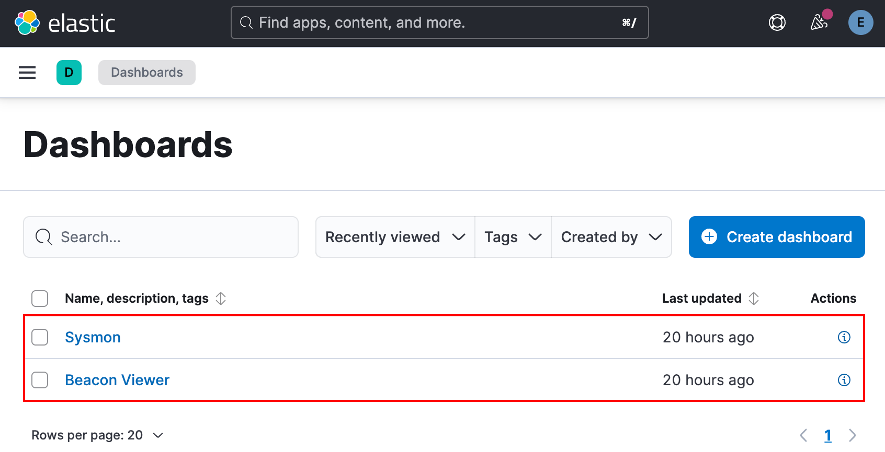

# BeaKer (Beaconing Kibana Executable Report)

[](https://www.activecountermeasures.com/free-tools/beaker/)

If you get value out of BeaKer and would like to go a step further with integrating it into your network threat hunting workflow, then take a look at [AC-Hunter](https://www.activecountermeasures.com/).

Sponsored by [Active Countermeasures](https://www.activecountermeasures.com/).

---

BeaKer is a threat hunting tool designed to provide insight into the Windows hosts, users, and executables responsible for generating network traffic.

BeaKer visualizes Microsoft Sysmon network using custom Kibana dashboards that show which users and executables created connections between two given IPs, how many times they've connected, the protocols and ports used, and much more.

Windows agents use [Sysmon](https://learn.microsoft.com/en-us/sysinternals/downloads/sysmon) to log events to the Windows Event Log. Agents then send logs to the BeaKer server using [Winlogbeat](https://www.elastic.co/docs/reference/beats/winlogbeat/). Logs are imported into [Elasticsearch](https://www.elastic.co/docs/reference/elasticsearch/) and can then be viewed through custom dashboards in [Kibana](https://www.elastic.co/docs/reference/kibana).

Sysmon collects the following information from Windows systems:

| Category    | Information                                            |
| ----------- | ------------------------------------------------------ |
| Source      | IP address, Hostname, Port                             |
| Destination | IP address, Hostname, Port                             |
| Network     | Transport protocol, Application protocol, Community ID |
| Process     | PID, Executable, Entity ID                             |
| User        | Domain, Name                                           |
| Timestamp   |                                                        |

## Installation

BeaKer is provided as two separate components, specifically a Linux server and a Windows agent. The following section describes system requirements and installation procedures for both.

### Server

#### System Requirements

The BeaKer server is supported on the following platforms:

| OS     | Versions         | Platform |
| :----- | :--------------- | :------- |
| CentOS | `9 Stream`       | `amd64`  |
| Rocky  | `9`              | `amd64`  |
| RHEL   | `9`              | `amd64`  |
| Ubuntu | `22.04`, `24.04` | `amd64`  |

Hardware requirements and recommendations are listed below:

|         | Minimum | Recommended |
| ------- | ------- | ----------- |
| CPU     | 2 cores | 4 cores     |
| Memory  | 8 GB    | 16 GB       |
| Storage | 128 GB  | 256 GB      |

Note that recommended hardware specifications are listed as a lower bound. More resources will be beneficial when deploying BeaKer in larger environments.

#### Installation Procedure

> [!Important] BeaKer Upgrade Notice
> The latest BeaKer installer can be used to upgrade BeaKer installations using ELK stack versions as old as 7.17.
> Upgrading BeaKer installations should not result in data loss, however this is not guaranteed. To ensure that no data is lost, it is recommended that you first perform a [Snapshot](https://www.elastic.co/docs/deploy-manage/tools/snapshot-and-restore).
> The BeaKer environment file will be preserved through server upgrades. However, web certificates will be re-generated when upgrading from BeaKer v0.0.14 to v1.0.0.
> Upgrading BeaKer using the latest installer is only possible on Linux distributions as old as Ubuntu 20.04, CentOS 8, and Rocky Linux 8.

Download the [latest BeaKer release](https://github.com/activecm/BeaKer/releases/latest) tarball and upload it to an appropriate Linux system.

Connect to the system, decompress the release archive, and run the installer from the decompressed directory. The installer can be used to install BeaKer to a single local or remote system. If installing to a remote system, first ensure that the current user can connect to the target system via SSH.

```bash
./install_beaker.sh {{ target }}
```

The BeaKer installer will prompt for a `sudo` password (password for current user on machine running the installer), as well as a `BECOME` password (password for target user on the destination system). The installer will then complete all installation tasks automatically. When installing to a remote system, the target will be automatically restarted if rebooting is required to apply system updates.

#### Credentials

When using the BeaKer installer to upgrade an old BeaKer server installation, passwords will not be changed.

During a fresh BeaKer installation, account passwords will be randomly-generated and stored in the file at `/opt/BeaKer/.env` after installation is completed.

The `elastic` account password, stored in a variable named `ELASTIC_PASSWORD`, must remain stored in the environment file. The `sysmon-ingest` password, stored in a variable named `INGEST_PASSWORD`, can be removed from the environment file if you prefer to store it in a password manager.

The `elastic` account should be used to authenticate to Kibana. The `sysmon-ingest` account does not have access to Kibana and should be used to authenticate agents to the BeaKer server.

### Agent

#### System Requirements

BeaKer agents are supported on 64-bit Windows operating systems with PowerShell version 3+ available. Additionally, Winlogbeat versions are constrained by the version of Elasticsearch, specifically the minimum wire compatibility version. To view this value, browse to `https://{{ beaker_host }}:9200`, log in using credentials found in the BeaKer server environment file, and observe the value of the `minimum_wire_compatibility_version` JSON field. The following JSON response is an example taken from a BeaKer system running Elasticsearch version `8.17.10`:

```json
{
  "name": "f60c52e796fb",
  "cluster_name": "BeaKer-Elasticsearch",
  "cluster_uuid": "Xuenv_Q0TdK67xdq-TLVDQ",
  "version": {
    "number": "8.17.10",
    "build_flavor": "default",
    "build_type": "docker",
    "build_hash": "e5c4b2af120c131ea2885730f6693cb7d40a0a63",
    "build_date": "2025-08-08T08:36:52.872377389Z",
    "build_snapshot": false,
    "lucene_version": "9.12.0",
    "minimum_wire_compatibility_version": "7.17.0",
    "minimum_index_compatibility_version": "7.0.0"
  },
  "tagline": "You Know, for Search"
}
```

#### Installation Procedure

Download the [latest BeaKer release](https://github.com/activecm/BeaKer/releases/latest) `install-sysmon-beats.ps1` file to an appropriate Windows system.

Open an administrative PowerShell terminal. Depending on your environment, you may need to temporarily disable script execution policies using the `Set-ExecutionPolicy` cmdlet. Then, run the agent installer:

```powershell
.\install-sysmon-beats.ps1 {{ beaker_host }} 9200
```

The agent installer will then prompt for credentials. Enter `sysmon-ingest` for the username and use the password stored in the BeaKer server environment file.

### Uninstallation Procedure

To uninstall the BeaKer agent, run the following from an administrative Command Prompt or PowerShell terminal:

- `C:\Program Files\Winlogbeat-BeaKer\uninstall-service-winlogbeat.ps1`
- `C:\Program Files\Sysmon\Sysmon64.exe -u`

This will stop and remove all services associated with BeaKer.

## Usage

### Server

On the BeaKer server, the `beaker` script can be used to manage BeaKer's Docker containers. The table below contains a list of operations and their associated commands.

| Operation                          | Command                         |
| :--------------------------------- | :------------------------------ |
| Start BeaKer (foreground)          | `beaker up`                     |
| Start BeaKer (background)          | `beaker up -d`                  |
| Start BeaKer (recreate containers) | `beaker up -d --force-recreate` |
|                                    |                                 |
| Stop BeaKer                        | `beaker down`                   |
|                                    |                                 |
| View logs (dump)                   | `beaker logs`                   |
| View logs (follow)                 | `beaker logs -f`                |
| View logs (just Elasticsearch)     | `beaker logs -f elasticsearch`  |
| View logs (just Kibana)            | `beaker logs -f kibana`         |

### Kibana

Once BeaKer is running, browse to `https://{{ beaker_host }}:5601` and log in using the `elastic` account and the password found in the BeaKer environment file. Upon first logging in, your browser will be redirected to the Kibana landing page. From here, click on the `Dashboards` button within the `Analytics` section of the sidebar.


BeaKer provides two dashboards, named `Sysmon` and `Beacon Viewer`. When first using Kibana, the dashboard list shown below will be displayed when navigating the the Dashboards page. When browsing to Kibana later, the previously opened dashboard will be automatically opened.



The `Sysmon` dashboard displays raw Sysmon data as sent from BeaKer agents. The `Beacon Viewer` shows a view tailored to the discovery of anomalous or malicious activity within your environment. The graphic below shows an example of searching for and viewing information within the `Beacon Viewer` dashboard.


Searches can be performed using Kibana Query Language (KQL). For more information regarding KQL syntax, refer to Elasticsearch's [KQL documentation](https://www.elastic.co/docs/reference/query-languages/kql)
